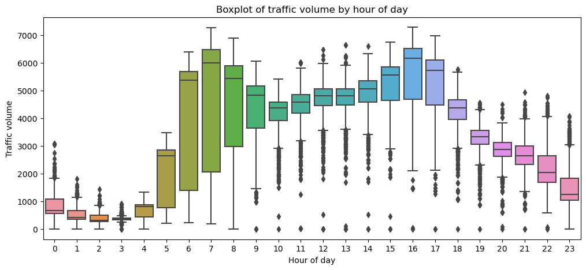
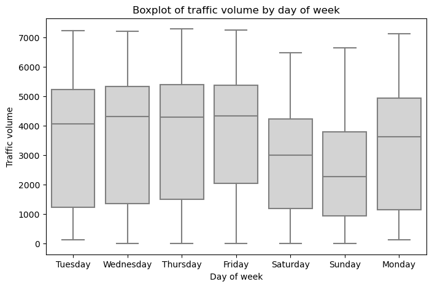
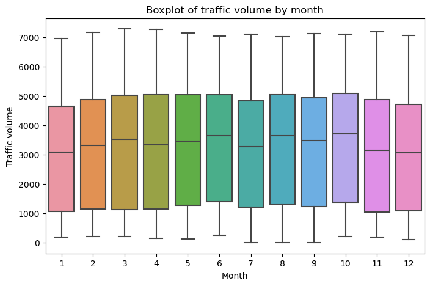
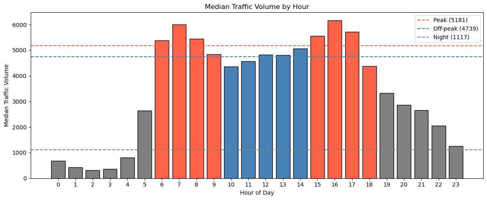
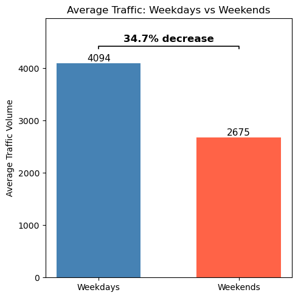
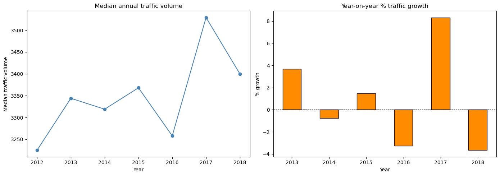
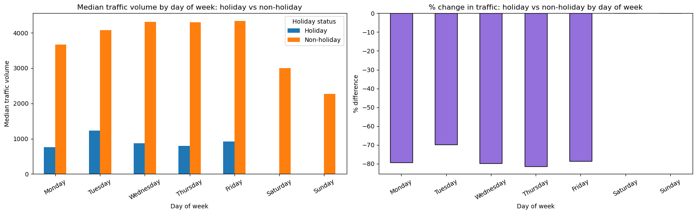
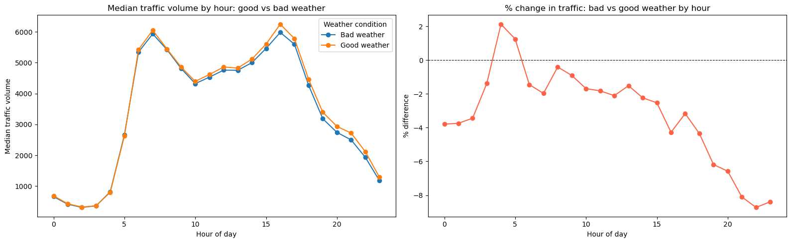
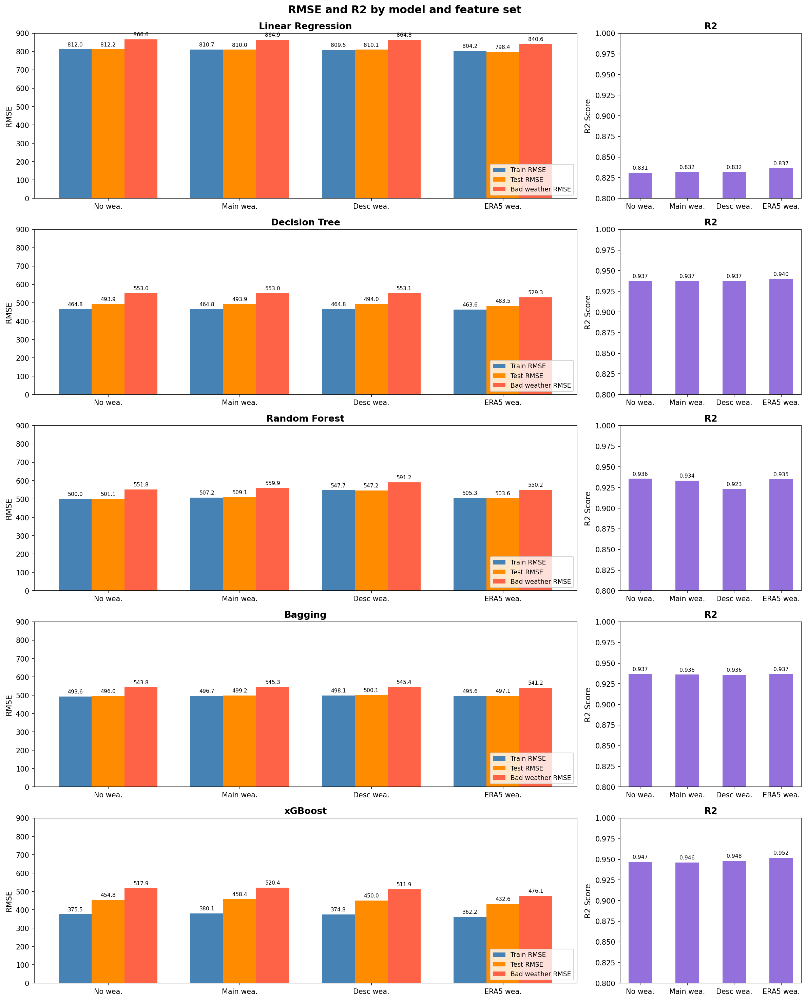
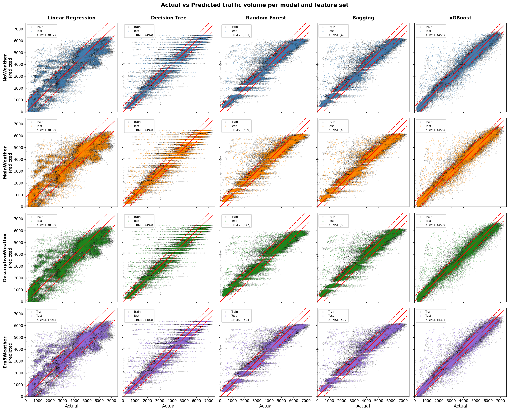

# ERA5 Traffic Volume Prediction

Hourly traffic volume prediction on Minneapolis I-94 using atmospheric reanalysis data (ERA5) as an alternative to local weather station observations. Five regression models are benchmarked across four weather feature sets, including a comparison between directly observed weather and gridded ERA5 climate data.

**Datasets**
- [Metro Interstate Traffic Volume](https://archive.ics.uci.edu/dataset/492/metro+interstate+traffic+volume) -- hourly traffic counts on I-94, 2012-2018
- [ERA5 Hourly Data on Single Levels](https://cds.climate.copernicus.eu/datasets/reanalysis-era5-single-levels) -- gridded atmospheric reanalysis, requested year-by-year

**Models:** Linear Regression, Decision Tree, Random Forest, Bagging, XGBoost

**Evaluation:** R², RMSE (train), RMSE (test), RMSE ("bad weather" only)

---

## Repository Structure

```
ERA5-traffic-prediction/
├── ERA5 data (raw)/           # Raw GRIB files from Copernicus CDS
├── ERA5 data (csv)/           # GRIB converted to CSV via grib2csv.py
├── Results/                   # Model evaluation CSVs per feature set
├── cleaned data/              # Processed outputs from EDA notebook
├── images/                    # Images used in README.md
├── unused data/               # Other traffic datasets not used
├── old/               	       # Previous iterations of this proejct
├── 01_EDA_and_feature_engineering.ipynb
├── 02_data_modelling.ipynb
├── ERA5_API_DL.py             # Attempted API download (abandoned due to request size)
├── Metro_Interstate_Traffic_Volume.csv
└── README.md
```

---

## Data Pipeline

### 1. Data Collection

ERA5 data was requested year-by-year from the Copernicus Climate Data Store in GRIB format, then converted to CSV using a custom `grib2csv.py` script. ERA5 coordinates were fixed to the MN DoT ATR Station 301 (Route I-94, Reference Post 239+00.922), located using the [Roadway Project Mapping Application](https://www.dot.state.mn.us/roadway/data/rpma.html).

An API-based download (`ERA5_API_DL.py`) was attempted but abandoned due to request size limitations.

### 2. Data Cleaning

**Traffic dataset (48,176 rows after cleaning)**
- Removed 17 duplicate rows.
- Removed rows with temperature below 200 K (-73.15 degrees Celsius; physically impossible; measurement error).
- Removed one row with rainfall exceeding 8,000 mm (instrument error).
- Filled `holiday` NaN values with `'None'` to denote non-holiday hours.
- Standardised inconsistent capitalisation in `weather_description` (e.g. `'Sky is Clear'` -> `'sky is clear'`).

**ERA5 dataset**
- Seven annual CSV files (2012-2018) concatenated into one dataframe.
- Columns retained: 2m temperature (`t2m`), total/low/medium/high cloud cover (`tcc`, `lcc`, `mcc`, `hcc`), 7 precipitation types (`ptype`), total precipitation (`tp`), snowfall (`sf`), convective precipitation (`cp`), large-scale precipitation (`lsp`).

### 3. Feature Engineering

**Cyclic time encoding**

Hour of day, day of week, and month of year are encoded using 5-harmonic sin/cos decomposition rather than one-hot encoding. This preserves the cyclic nature of these features and reduces dimensionality from 43 columns (24+7+12) down to 30 (5x2x3).

**One-hot encoding**
- `holiday`: 11 binary columns (one per named US holiday; `None` dropped)
- `weather_main`: 11 binary columns (main weather categories)
- `weather_description`: 37 binary columns (detailed weather descriptions)
- ERA5 precipitation type: 14 binary columns (7 precipitation types combined with a 0.1 mm threshold, producing light/heavy variants per type, e.g. `Rain_light`, `Rain_heavy`)

---

## EDA Insights

### Time Patterns

- **Traffic volume is strongly driven by time of day and day of week.**



<p align="center">
  
  
</p>

- **Peak vs off-peak hours** (defined as 06:00-09:00 and 15:00-18:00 vs 10:00-15:00): Peak hours (median 5,181) carry 9.3% more traffic than off-peak hours (median 4,739). Nighttime volume (median 1,117) drops to less than 25% of peak levels.



- **Weekday vs weekend:** Weekend traffic is 34.7% lower than weekdays (median 2,675 vs 4,094).

<p align="center">
  
</p>

- **Year-on-year growth:** No sustained growth or decline trend over 2012-2018. The median annual growth rate across years is 0.36%, with fluctuations between -3.7% and +8.3%.



### Weather Effects

- **Holidays** reduce traffic by 76.0% overall on weekdays. The reduction is consistent across all weekdays (ranging from -69.9% on Tuesdays to -81.4% on Thursdays). No holiday observations fall on weekends.



- **Bad weather** (any `weather_main` value other than `Clear` or `Clouds`) generally reduces median traffic. The effect is strongest late at night (hours 20:00-23:00, -6% to -9%) and weakest in the early morning hours 04:00-05:00, where traffic is marginally higher in bad weather.



---

## Modelling

### Feature Sets

- Four feature sets are evaluated to isolate the contribution of each weather data source:

| Feature set | Weather features included | Total columns |
|---|---|---|
| No weather | None (time + temperature + holidays only) | 42 |
| Main weather | `weather_main` (11 categories) | 53 |
| Descriptive weather | `weather_description` (37 categories) | 79 |
| ERA5 weather | ERA5 precipitation type x threshold (14 columns) | 56 |

All feature sets include: temperature, 30 harmonic seasonality columns (hour/day/month), and 11 holiday indicator columns.

### Model Hyperparameters

- All tree-based models are regularised to reduce overfitting observed in initial no-hyperparameter-tuning runs.

| Model | Key hyperparameters |
|---|---|
| Linear Regression | Default (no tuning required) |
| Decision Tree | `max_depth=8`, `min_samples_split=40`, `min_samples_leaf=20` |
| Random Forest | `n_estimators=100`, `max_depth=8`, `min_samples_split=40`, `max_features='sqrt'` |
| Bagging | `n_estimators=100`, `max_samples=0.5`, `max_features=0.5`, `bootstrap_features=True` |
| XGBoost | `max_depth=4`, `min_child_weight=50`, `subsample=0.5`, `reg_alpha=10`, `reg_lambda=10`, `gamma=2` |

- The test set is the last 30% of rows in chronological order, simulating future prediction rather than interpolation.

---

## Results

### Model Comparison Across Feature Sets

Plotted full numerical results across all 20 model-feature combinations:



### Actual vs Predicted Traffic Volume



### Key Takeaways

**XGBoost with ERA5 features is the best-performing configuration** across all metrics. This is the only configuration that significantly breaks below 500 unit errors on test RMSE and bad weather RMSE.

**ERA5 weather features consistently outperform observed weather features**, particularly on bad weather RMSE, the margin where weather quality matters most. The XGBoost with ERA5 improves bad weather RMSE by 9% (41 units) over its no-weather baseline, while the same model using descriptive station weather sees no meaningful gain.

**Adding observed weather descriptions (main or detailed) provides minimal benefit** over using no weather at all, suggesting the station weather data adds little predictive signal beyond what time and holiday features already capture.

**Time and holiday features dominate predictive power.** Even the no-weather XGBoost achieves R² = 0.947, close to the best result of 0.952. The biggest performance gap is between linear regression and all tree-based models, reflecting strong nonlinear interactions between time-of-day and traffic patterns.

**Linear regression substantially underperforms** across all feature sets (R² ~0.83, RMSE ~800), indicating the time-traffic relationship is not well captured by a linear model.

---

## Stack

- [pandas](https://pandas.pydata.org) -- data wrangling
- [NumPy](https://numpy.org) -- numerical operations and harmonic encoding
- [scikit-learn](https://scikit-learn.org) -- Linear Regression, Decision Tree, Random Forest, Bagging
- [XGBoost](https://xgboost.readthedocs.io) -- gradient boosted trees
- [Matplotlib](https://matplotlib.org) / [Seaborn](https://seaborn.pydata.org) -- visualisation
- [cfgrib](https://github.com/ecmwf/cfgrib) -- GRIB file reading (via `grib2csv.py`)
